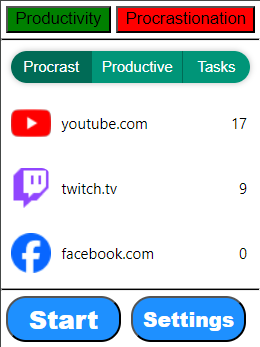
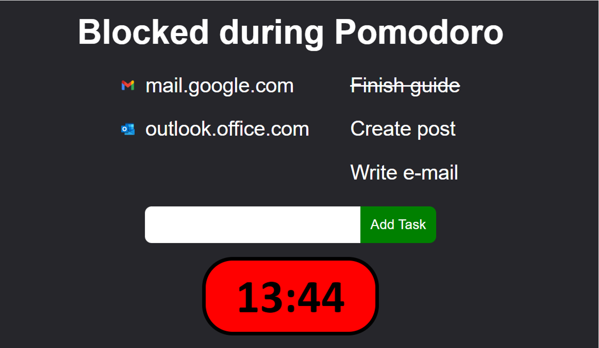
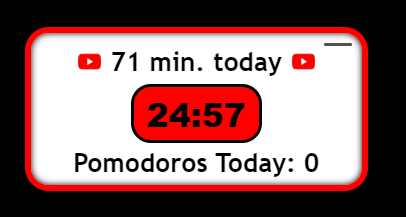

Click "Load unpacked" and navigate to "dist" folder.

Use popup to label current site as either Procrastination or Productive

In settings you can set length of Pomodoro and Break, and time of day the popup should show up on procrastination sites

